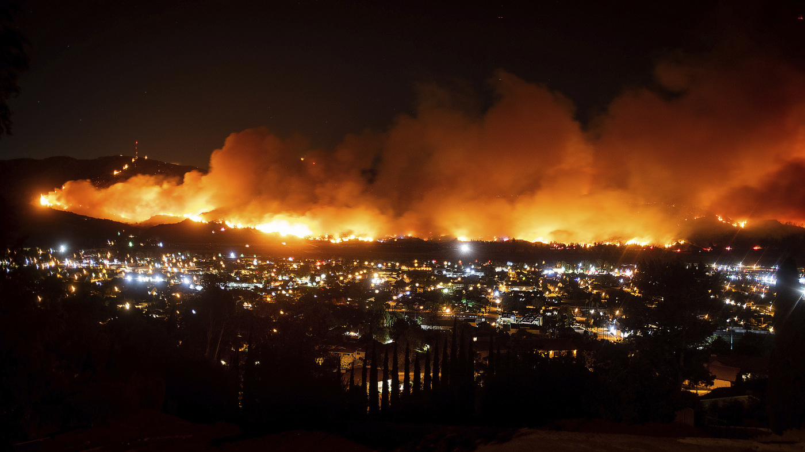

## Wildfire-Analysis

## Deployment link 

- https://javanejones.github.io/Wilfire-Analysis/

## Introduction

*

*

*

## Tools Used

1. Clean and organize
  
  -	Python- Pandas

  -	Pyhton- Numpy

  -	Pyhton- datetime

  -	Python json

  -	Excel
  
  
2. Data Visualization

  -	Plotly- Js

  -	Python- Follium

  -	Python- Seaborn

  -	Python- Matplotlib

  -	Python- Pandas

  -	Javascript
  
  
3. Deployment

  -	HTMl/CSS

  -	Javacript

## Data Sources

1. Wildfire data https://www.fire.ca.gov/incidents/
2. Weather data https://www.ncdc.noaa.gov/cag/ & https://aqs.epa.gov/aqsweb/airdata/download_files.html#Annual
